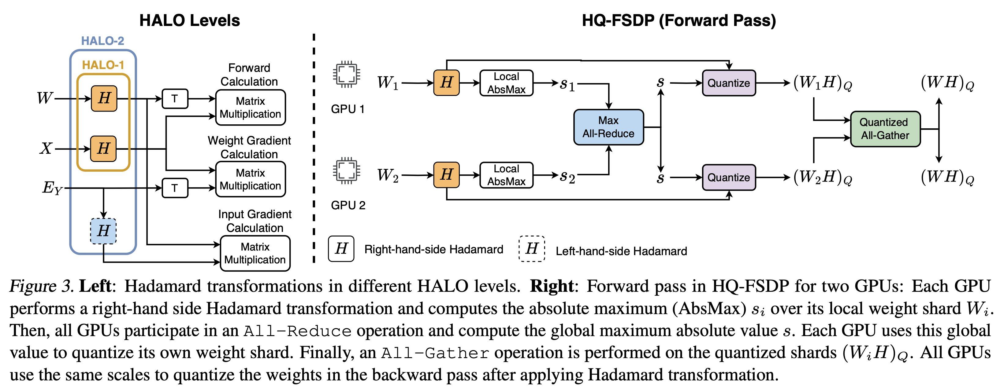

# 😇 HALO: Hadamard-Assisted Lower-Precision Optimization for LLMs 🚀

[](https://arxiv.org/abs/2501.02625)

__HALO__ is a novel quantization-aware training method for fine-tuning Large Language Models (LLMs) with low-precision matrix multiplications. It integrates **Hadamard transformations** to mitigate outliers, enabling accurate **INT8** and **FP6** fine-tuning while maintaining compute efficiency. HALO achieves up to **1.41×** speedup over full-precision fine-tuning while preserving accuracy, supporting both full and parameter-efficient fine-tuning (PEFT). 



__HALO__ is implemented with efficient CUDA kernels and integrates seamlessly with **Fully Sharded Data Parallel (FSDP)** for low-precision communication, making it ideal for large-scale distributed training. 💡

## Installation 🛠️
First, start by cloning the repository with its submodules:

```bash
git clone --recurse-submodules https://github.com/IST-DASLab/HALO.git
```
or if it you have already cloned the repository, you can update the submodules with:
```bash
git submodule update --init --recursive
```

Create a new environment (`python=3.10` is tested). Our code currently supports CUDA >=12.4, but using older CUDA versions should be possible by disabling some of the CUDA kernels.

```bash
# Create an environment, with whatever method you want
conda create -n halo python=3.10
conda activate halo
```

Then run the following commands in order:

```bash
# Install the requirements
source install.sh
```

## Training 👨‍🏫
To fine-tune a Llama-3-8B model, you can run:
```bash
cd scripts
CUDA_VISIBLE_DEVICES=0,1,2,3 bash train_halo.sh DATASET=<dataset> LR=<lr> KERNEL_TYPE=<kernel_type>
```

For the dataset and lr you can try the following combinations: (sql, 3e-5), (viggo, 4e-5), (gsm8k, 6e-6). Regarding the kernel type, you can choose any of the following:
- `base`: this runs the base BF16 experiment, with HALO disabled.
- `halo0_fp8`: runs our Halo level 0 with FP8 precision.
- `halo2_int8`: runs our Halo level 2 with INT8 precision.

You can add `_qfsdp` to enable HQ-FSDP, for example: `halo0_fp8_qfsdp`. Other combinations of precision and HALO levels also work, e.g., `halo1_int8_qfsdp`.


## Benchmarks 📊
The benchmark files are located in the `tests` directory:
```bash
cd tests
```

### Linear Module
You can run the single layer benchmarks using the following command:
```bash
CUDA_VISIBLE_DEVICES=0 python linear_module_benchmark.py --kernels base switchback jetfire halo2_int8 halo1_fp8 halo0_fp8 halo1_fp8
```

### Per-Block Benchmarks
To run the single-gpu block-level benchmarks, run:
```bash
CUDA_VISIBLE_DEVICES=0 python benchmark_llama3_halo.py --num_blocks 3 --kernels base haloi_int8 haloi_fp8 halo0_fp8 halo1_fp8 halo2_int8
```
Here `haloi` corresponds to the Ideal kernels in the paper.

For multi-gpu INT8 benchmarks, run:
```bash
NCCL_NTHREADS=64 CUDA_VISIBLE_DEVICES=0,1,2,3 torchrun --standalone --nnodes=1 --nproc-per-node=4 benchmark_llama3_halo.py --fsdp --num_blocks 3 --kernels base haloi_int8 haloi_int8_qfsdp halo2_int8 halo2_int8_qfsdp
```
and for FP8:
```bash
NCCL_NTHREADS=64 CUDA_VISIBLE_DEVICES=0,1,2,3 torchrun --standalone --nnodes=1 --nproc-per-node=4 benchmark_llama3_halo.py --fsdp --num_blocks 3 --kernels base haloi_fp8 haloi_fp8_qfsdp halo0_fp8 halo0_fp8_qfsdp halo1_fp8 halo1_fp8_qfsdp
```
Note that `NCCL_NTHREADS=64` is tuned for RTX 4090. For newer GPUs, you may use the default value without setting it.


## Citation 📖
If you use HALO in your research, please cite our paper:
```bibtex
@article{halo2025,
      title={HALO: Hadamard-Assisted Lower-Precision Optimization for LLMs}, 
      author={Saleh Ashkboos and Mahdi Nikdan and Soroush Tabesh and Roberto L. Castro and Torsten Hoefler and Dan Alistarh},
      year={2025},
      eprint={2501.02625},
      archivePrefix={arXiv},
      primaryClass={cs.LG},
      url={https://arxiv.org/abs/2501.02625}, 
}
```